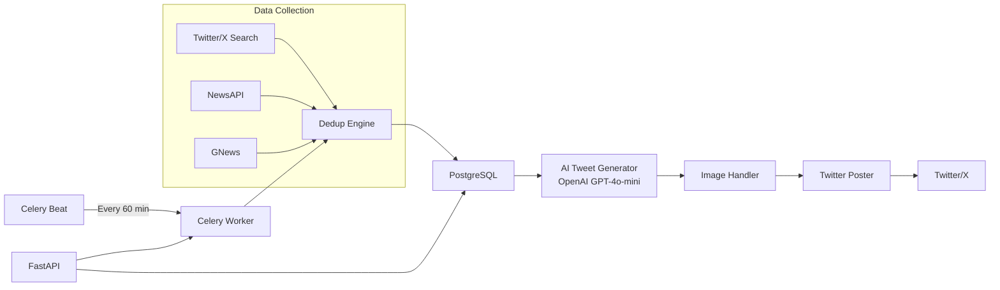

# TweetVeet — AI Cricket Twitter Bot 🏏🤖

A production-ready, fully automated system that collects real-time cricket news, generates engaging tweets using AI, attaches relevant images, and posts them to Twitter/X on a smart schedule.

## Architecture



## Features

- **Multi-source collection** — Twitter/X search + NewsAPI + GNews
- **Dual deduplication** — SHA-256 exact + SimHash fuzzy matching
- **3-style AI generation** — Hype, Analytical, and Casual tweet variants
- **Auto-ranking** — Weighted scoring to pick the best tweet
- **Image priority** — Prefers X media from source, falls back to Unsplash
- **Rate limiting** — Token-bucket with human-like random delays
- **Engagement** — Auto-reply to trending tweets, quote-tweet viral posts
- **Anti-spam** — Hourly limits, cooldowns, blocklists
- **REST API** — Status, history, stats, manual trigger
- **Docker-ready** — Multi-stage build, compose with Postgres + Redis

## Quick Start

### 1. Prerequisites

- Python 3.12+
- PostgreSQL 16+
- Redis 7+
- API keys (see `.env.example`)

### 2. Setup

```bash
# Clone and enter project
cd tweetveet

# Create virtual environment
python -m venv venv
venv\Scripts\activate   # Windows
# source venv/bin/activate  # Linux/Mac

# Install dependencies
pip install -r requirements.txt

# Configure environment
cp .env.example .env
# Edit .env with your API keys
```

### 3. Database Setup

```bash
# Start PostgreSQL and Redis (if not using Docker)
# Then create the database:
createdb tweetveet

# Run migrations (or let FastAPI auto-create tables)
alembic upgrade head
```

### 4. Run Locally

```bash
# Terminal 1: Start API server
uvicorn app.main:app --host 0.0.0.0 --port 8000 --reload

# Terminal 2: Start Celery worker
celery -A celery_worker.celery_app worker --loglevel=info

# Terminal 3: Start Celery beat scheduler
celery -A celery_worker.celery_app beat --loglevel=info
```

### 5. Run with Docker (recommended)

```bash
# Start all services
docker compose up -d

# Check logs
docker compose logs -f api
docker compose logs -f worker

# Stop
docker compose down
```

## API Endpoints

| Method | Endpoint | Description |
|--------|----------|-------------|
| `GET` | `/health` | Quick health check |
| `GET` | `/api/status` | Bot status + stats |
| `GET` | `/api/tweets?page=1` | Posted tweet history |
| `GET` | `/api/sources?page=1` | Collected sources |
| `POST` | `/api/trigger` | Manually trigger pipeline |
| `GET` | `/api/stats` | Aggregated statistics |

Interactive API docs at: `http://localhost:8000/docs`

## AWS Deployment

```bash
# First-time setup
EC2_HOST=ubuntu@your-ip ./scripts/deploy.sh --setup

# Deploy
EC2_HOST=ubuntu@your-ip ./scripts/deploy.sh --deploy

# Update
EC2_HOST=ubuntu@your-ip ./scripts/deploy.sh --update
```

## Project Structure

```
tweetveet/
├── app/
│   ├── api/routes.py           # REST API endpoints
│   ├── collectors/
│   │   ├── base.py             # Abstract collector + retry
│   │   ├── twitter_collector.py # Twitter/X v2 search
│   │   ├── news_collector.py   # NewsAPI + GNews
│   │   └── dedup.py            # SHA-256 + SimHash dedup
│   ├── generator/
│   │   ├── prompts.py          # 3-style prompt templates
│   │   └── tweet_generator.py  # OpenAI generation + ranking
│   ├── media/
│   │   └── image_handler.py    # X media preferred, Unsplash fallback
│   ├── poster/
│   │   └── twitter_poster.py   # Rate-limited Twitter posting
│   ├── engagement/
│   │   └── auto_engage.py      # Auto-reply + quote-tweet
│   ├── scheduler/
│   │   └── tasks.py            # Celery pipeline tasks
│   ├── models/tweet.py         # SQLAlchemy models
│   ├── config.py               # Pydantic settings
│   ├── database.py             # Async SQLAlchemy
│   ├── main.py                 # FastAPI app
│   └── utils/logger.py         # JSON structured logger
├── alembic/                    # Database migrations
├── scripts/deploy.sh           # AWS deployment
├── Dockerfile                  # Multi-stage build
├── docker-compose.yml          # Full stack
├── requirements.txt            # Dependencies
└── .env.example                # Config template
```

## Configuration

All settings are controlled via environment variables (`.env` file). Key configurations:

| Variable | Default | Description |
|----------|---------|-------------|
| `POSTING_INTERVAL_MINUTES` | `60` | How often the bot runs |
| `MAX_TWEETS_PER_HOUR` | `5` | Max tweets posted per hour |
| `MAX_REPLIES_PER_HOUR` | `10` | Max engagement replies per hour |
| `ENABLE_ENGAGEMENT` | `true` | Enable auto-reply/quote features |
| `ENABLE_IMAGE_POSTING` | `true` | Attach images to tweets |
| `PREFER_X_MEDIA` | `true` | Prefer X media over Unsplash |
| `OPENAI_MODEL` | `gpt-4o-mini` | OpenAI model for generation |

## License

MIT
